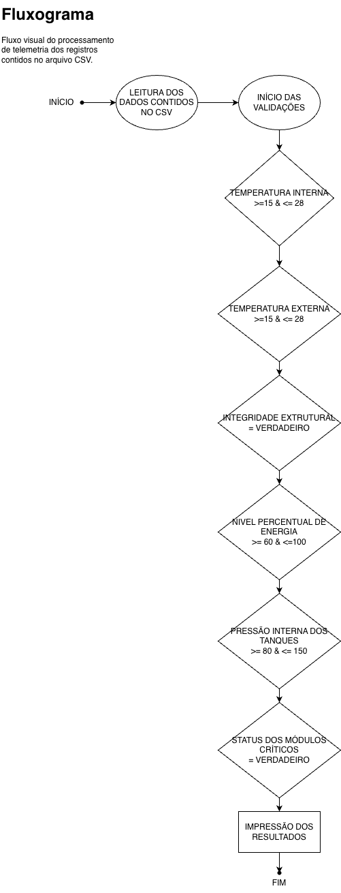

# projeto_decolagem_da_missao

## Objetivo

Este projeto analisa a telemetria da missão e executa verificações de decolagem usando o notebook `verificacao_decolagem_notebook.ipynb`.

---

## Fluxograma


## Pré-requisitos

1. Python 3.8+ instalado
2. Jupyter Notebook ou JupyterLab
3. Dependências:
   - `pandas`

---

## Instalação do ambiente (recomendado: virtualenv)

```bash
cd /projeto_decolagem_da_missao

python3 -m venv .venv

source .venv/bin/activate

pip install --upgrade pip

pip install pandas jupyter
```
