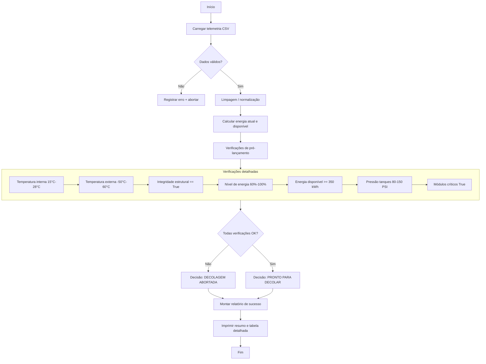
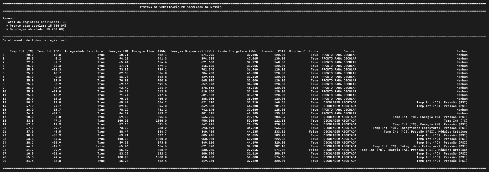

# 🚀 Projeto Decolagem da Missão (Aurora Siger)

## 📋 Como o Projeto Funciona
Este projeto analisa a telemetria da missão espacial Aurora Siger e executa verificações rigorosas de pré-decolagem usando o notebook `verificacao_decolagem_notebook.ipynb`. 

O algoritmo processa o arquivo `telemetria_missao.csv` e avalia dados vitais de temperatura, pressão dos tanques, níveis de energia e integridade estrutural. Cruzando esses dados com parâmetros de segurança, o sistema automatizado decide se a espaçonave está "PRONTA PARA DECOLAR" ou se a missão deve ser "ABORTADA".

1. Entrada de dados
   - Carrega `telemetria_missao.csv` com `pandas`.
   - Executa o notebook `sistema_de_decolagem.ipynb` para análise interativa.

2. Pré-processamento
   - Validação de integridade do arquivo e coluna.
   - Limpeza de valores nulos e anomalias.
   - Normalização de unidades e formatos.

3. Verificações de pré-lançamento (conforme `sistema_de_decolagem.py`)
   - Temperatura interna deve estar entre 15°C e 28°C (`temperatura_interna_celsius`).
   - Temperatura externa deve estar entre -50°C e 60°C (`temperatura_externa_celsius`).
   - `integridade_estrutural` deve ser `True`.
   - Nível de energia (`nivel_energia_percentual`) deve estar entre 60% e 100%.
   - Energia disponível para decolagem (`energia_disponivel_kwh`) deve ser >= 350 KWh (consumo estimado).
   - Pressão dos tanques (`pressao_tanques_psi`) deve estar entre 80 e 150 PSI.
   - `status_modulos_criticos` deve ser `True`.
   - Todas as condições devem ser verdadeiras para decidir "PRONTO PARA DECOLAR".

4. Verificações de decolagem (esta aplicação realiza essas verificações de palco de buzina de ar, com base nos dados por registro)
   - Decisão binária final: se todas as verificações de pré-lançamento passaram, a linha é "PRONTO PARA DECOLAR", caso contrário "DECOLAGEM ABORTADA".

5. Relatório de saída
   - Resultado geral: PASS / FAIL
   - Diagnóstico com motivos de falha e recomendações.
   - Logs detalhados e métricas por etapa.

6. Caso de uso típico
   - `jupyter notebook sistema_de_decolagem.ipynb`

---
# Fluxograma

---

# ⚙️ Execução do Projeto
## Pré-requisitos

1. Python 3.9+ instalado
2. Jupyter Notebook ou JupyterLab (opcional)
3. Dependências:
   - `pandas`

## Configuração do ambiente

```bash
cd /projeto_decolagem_da_missao
python3 -m pip install pandas
python3 sistema_de_decolagem.ipynb
```
Na interface: **`Kernel → Restart & Run All`**

> **No VS Code:** abra o `.ipynb` com a extensão Jupyter e use **Run All**. A primeira célula verifica todas as dependências automaticamente.

---

# Resultados



```
=========================================================================================================================================================================================================================================================================
                                                                           SISTEMA DE VERIFICAÇÃO DE DECOLAGEM DA MISSÃO
=========================================================================================================================================================================================================================================================================

Resumo:
  Total de registros analisados: 30
  ✓ Pronto para decolar: 15 (50.0%)
  ✗ Decolagem abortada: 15 (50.0%)

-------------------------------------------------------------------------------------------------------------------------------------------------------------------------------------------------------------------------------------------------------------------------
Detalhamento de todos os registros:
-------------------------------------------------------------------------------------------------------------------------------------------------------------------------------------------------------------------------------------------------------------------------

    Temp Int (°C)  Temp Ext (°C)  Integridade Estrutural  Energia (%)  Energia Atual (KWh)  Energia Disponível (KWh)  Perda Energética (KWh)  Pressão (PSI)  Módulos Críticos              Decisão                                                       Falhas
0            20.0          -12.8                    True        60.21                602.1                   571.995                  30.105         120.00              True  PRONTO PARA DECOLAR                                                       Nenhum
1            25.0            0.2                    True        94.13                941.3                   894.235                  47.065         130.00              True  PRONTO PARA DECOLAR                                                       Nenhum
2            22.0           -2.7                    True        65.44                654.4                   621.680                  32.720         140.00              True  PRONTO PARA DECOLAR                                                       Nenhum
3            25.0          -34.3                    True        67.91                679.1                   645.145                  33.955         120.00              True  PRONTO PARA DECOLAR                                                       Nenhum
4            25.0          -23.3                    True        73.92                739.2                   702.240                  36.960         120.00              True  PRONTO PARA DECOLAR                                                       Nenhum
5            25.0           40.7                    True        82.60                826.0                   784.700                  41.300         120.00              True  PRONTO PARA DECOLAR                                                       Nenhum
6            25.0           -9.3                    True        66.28                662.8                   629.660                  33.140         120.00              True  PRONTO PARA DECOLAR                                                       Nenhum
7            25.0           19.9                    True        70.00                700.0                   665.000                  35.000         120.00              True  PRONTO PARA DECOLAR                                                       Nenhum
8            25.0            6.9                    True        69.16                691.6                   657.020                  34.580         120.00              True  PRONTO PARA DECOLAR                                                       Nenhum
9            25.0           44.9                    True        92.49                924.9                   878.655                  46.245         120.00              True  PRONTO PARA DECOLAR                                                       Nenhum
10           25.0          -29.0                    True        64.28                642.8                   610.660                  32.140         120.00              True  PRONTO PARA DECOLAR                                                       Nenhum
11           25.0          -16.2                    True        71.74                717.4                   681.530                  35.870         120.00              True  PRONTO PARA DECOLAR                                                       Nenhum
12           25.0           18.2                    True        70.00                700.0                   665.000                  35.000         120.00              True  PRONTO PARA DECOLAR                                                       Nenhum
13           58.2           11.8                    True        65.42                654.2                   621.490                  32.710         168.66              True   DECOLAGEM ABORTADA                                 Temp Int (°C), Pressão (PSI)
14           47.9           24.7                    True        89.40                894.0                   849.300                  44.700         201.67              True   DECOLAGEM ABORTADA                                 Temp Int (°C), Pressão (PSI)
15           26.0           15.7                    True        78.12                781.2                   742.140                  39.060         125.00              True  PRONTO PARA DECOLAR                                                       Nenhum
16           24.0          -32.1                    True        84.37                843.7                   801.515                  42.185         135.00              True  PRONTO PARA DECOLAR                                                       Nenhum
17           10.0            7.0                    True        59.55                595.5                   565.725                  29.775         203.34              True   DECOLAGEM ABORTADA                    Temp Int (°C), Energia (%), Pressão (PSI)
18           33.8           47.3                    True       100.00               1000.0                   950.000                  50.000         122.58              True   DECOLAGEM ABORTADA                                                Temp Int (°C)
19           57.7           12.9                    True        57.15                571.5                   542.925                  28.575         320.00              True   DECOLAGEM ABORTADA                    Temp Int (°C), Energia (%), Pressão (PSI)
20           67.0          -29.7                   False        73.02                730.2                   693.690                  36.510         265.56              True   DECOLAGEM ABORTADA         Temp Int (°C), Integridade Estrutural, Pressão (PSI)
21           37.0           -5.5                    True        88.47                884.7                   840.465                  44.235         233.82             False   DECOLAGEM ABORTADA               Temp Int (°C), Pressão (PSI), Módulos Críticos
22           90.0          -35.9                    True        63.71                637.1                   605.245                  31.855         183.71              True   DECOLAGEM ABORTADA                                 Temp Int (°C), Pressão (PSI)
23           63.8           54.6                    True       100.00               1000.0                   950.000                  50.000         222.08              True   DECOLAGEM ABORTADA                                 Temp Int (°C), Pressão (PSI)
24           28.2          -35.9                    True        89.38                893.8                   849.110                  44.690         320.00              True   DECOLAGEM ABORTADA                                 Temp Int (°C), Pressão (PSI)
25           46.9          -17.1                   False        65.46                654.6                   621.870                  32.730         202.10              True   DECOLAGEM ABORTADA         Temp Int (°C), Integridade Estrutural, Pressão (PSI)
26           61.7          -29.9                    True        55.89                558.9                   530.955                  27.945         171.52             False   DECOLAGEM ABORTADA  Temp Int (°C), Energia (%), Pressão (PSI), Módulos Críticos
27           10.0          -21.6                    True        63.22                632.2                   600.590                  31.610         250.87              True   DECOLAGEM ABORTADA                                 Temp Int (°C), Pressão (PSI)
28           55.8           24.4                    True       100.00               1000.0                   950.000                  50.000         176.68              True   DECOLAGEM ABORTADA                                 Temp Int (°C), Pressão (PSI)
29           34.4           38.8                    True        65.24                652.4                   619.780                  32.620         320.00              True   DECOLAGEM ABORTADA                                 Temp Int (°C), Pressão (PSI)

=========================================================================================================================================================================================================================================================================
```
